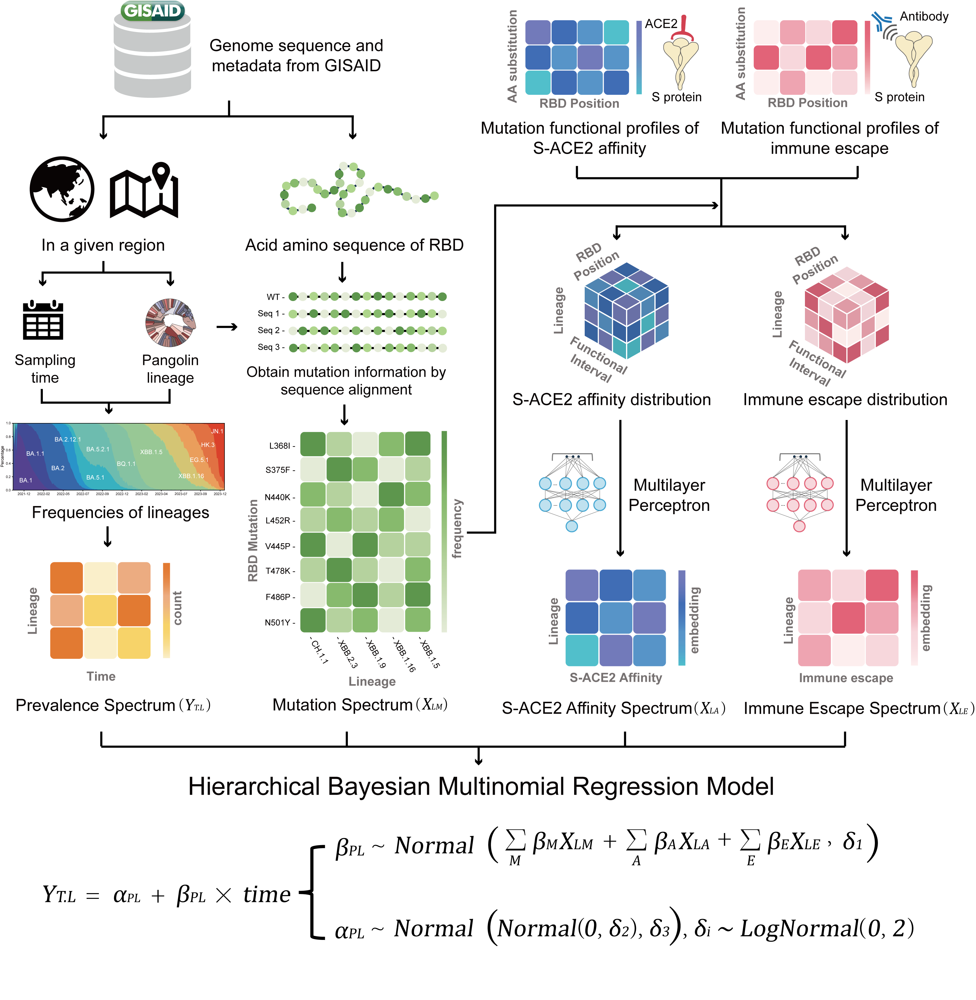

# CoVPF for SARS-CoV-2 Omicron lineages forecast

This is the code for the article ***Prevalence forecast of SARS-CoV-2 Omicron lineages by integrating genomic epidemiology and deep mutational scanning data***. CoVPF is a hierarchical Bayesian multinomial logistic regression model, which is inspired by PyR0 (Obermeyer et al., 2022). CoVPF incorporates functional deep mutational scanning (DMS) data (S-ACE2 affinity, immune escape) based on the integration of genomic epidemiology data, and further combines nonlinear relationships between mutations (epistasis) by introducing MLP, to achieve better performance of prevalence forecast for Omicron lineages.

CoVPF takes four spectra as input (prevalence, mutations, affinity and escape), epresenting the strength of the distribution. With a priori assumption of normality, the distributions of the regression parameters were learned by using variational inference after MLP, in which the prevalence spectrum was the observed variable  ($Y_{T.L}$) and the other three spectra ($X_{LM}$, $X_{LA}$, $X_{LE}$) were factors affecting the regression parameters.



## Usage

### Install pyro package

First install PyTorch. Then install via pip:

```shell
pip3 install pyro-ppl
```

Or install from source:

```shell
git clone https://github.com/pyro-ppl/pyro.git
cd pyro
pip install .[extras]
```

### Dependencies

```
python = 3.9
pytorch = 2.0.1
pyro = 1.8.5
numpy = 1.25
pandas = 1.5.3
matplotlib = 3.7.1
```

### Data Processing

The original data for CoVPF training used SARS-CoV-2 metadata downloaded from GISAID (https://gisaid.org/) and deep mutational scanning (DMS) data of S-ACE2 affinity (Starr, T. N. et al., 2022) and immune escape (Cao, Y. et al., 2022).

1. Processing of metadata

   To achieve faster speeds, we use shell and python to jointly cleanse and process over 16 million metadata data. See the specific command steps for details:

   ```
   process_metadata.sh
   process_metadata.py
   ```

2. Get training data

   After cleaning the metadata to obtain usable genomic epidemiological samples, the data can be processed to obtain four model inputa (Prevalence spectrum, Mutation spectrum, S-ACE2 affinity distribution, Immune escape distrubution).

   ```python
   python -u data_processing.py
   ```

### Train and forecast

Documentation of fitting, forecasting, and obtaining regression parameters to infer fitness:

```
train_data.py
pyro_model.py
function.py
```

### Test and plot

The code for all analyses and figures presented in the article and supplementary file is provided as notebook, which makes it easy to display and illustrate the results.

```
data_analysis.ipynb
mutation_freq_analysis.ipynb
fitting_forecast_benchmark.ipynb
mut_fitness_correlation.ipynb
submission_std_loss.ipynb
EG51growth.ipynb
inflection_plot.ipynb
irregular_submission.ipynb
biased.ipynb
high_fitness_plot.ipynb
plot_support.ipynb
```

### Citation

1. Obermeyer, F., Jankowiak, M., Barkas, N., Schaffner, S. F., Pyle, J. D., Yurkovetskiy, L., Bosso, M., Park, D. J., Babadi, M., MacInnis, B. L., Luban, J., Sabeti, P. C., & Lemieux, J. E., Analysis of 6.4 million SARS-CoV-2 genomes identifies mutations associated with fitness. *Science (New York, N.Y.)*, *376*(6599), 1327–1332 (2022).
2. Starr, T. N., Greaney, A. J., Stewart, C. M., Walls, A. C., Hannon, W. W., Veesler, D., & Bloom, J. D., Deep mutational scans for ACE2 binding, RBD expression, and antibody escape in the SARS-CoV-2 Omicron BA.1 and BA.2 receptor-binding domains. *PLoS pathogens*, *18*(11), e1010951 (2022).
3. Cao, Y., Yisimayi, A., Jian, F., Song, W., Xiao, T., Wang, L., Du, S., Wang, J., Li, Q., Chen, X., Yu, Y., Wang, P., Zhang, Z., Liu, P., An, R., Hao, X., Wang, Y., Wang, J., Feng, R., Sun, H., … Xie, X. S., BA.2.12.1, BA.4 and BA.5 escape antibodies elicited by Omicron infection. *Nature*, *608*(7923), 593–602 (2022).